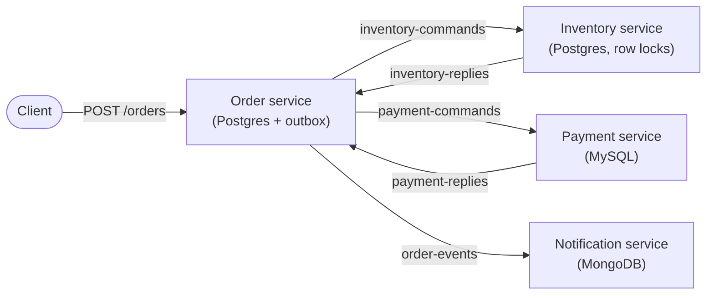
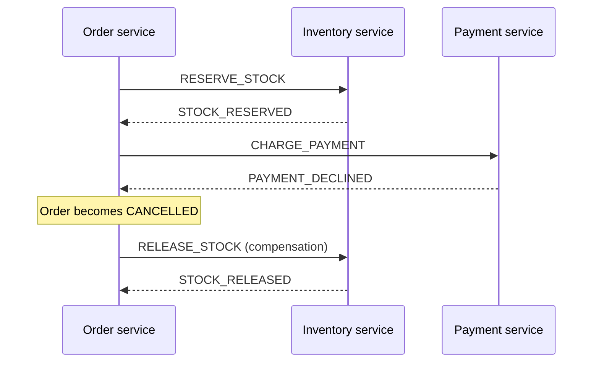

# OrderFlow

OrderFlow is an event-driven order system built from four Spring Boot services that coordinate through Kafka. Placing an order reserves stock, charges a payment, and sends a confirmation, and when something fails halfway through (a declined card, an item that just sold out, a service that crashed), the system undoes the steps it already took instead of leaving money or inventory in a half-finished state.

I built it to work through the problems that show up once a single request spans several services and several databases: keeping data consistent without distributed transactions, surviving crashes and duplicate messages, and being able to see what actually happened to one order across the whole system. Every claim below comes from a test I ran, and the scripts to rerun them are in `scripts/`.

## Architecture



Each service owns its own database, and no service ever reads another service's data. They talk only through Kafka topics. The databases are different on purpose: orders and inventory need strict transactional guarantees and row locking, which Postgres handles well; payments run on MySQL, which is common in payment stacks; and notifications are loosely structured documents with no relationships between them, a natural fit for MongoDB.

## How an order moves through the system

The order service runs an **orchestrated saga**. It is the one place that knows the whole flow, and it drives each step by sending a command and waiting for the reply:



On the happy path the payment is authorized and the order becomes `CONFIRMED`. If stock is short, the order is cancelled before any money is touched. If the payment is declined after stock was reserved, the saga runs a compensating step that gives the stock back. I chose orchestration over choreography (where each service simply reacts to the others' events) because once failures and compensations enter the picture, a flow that lives in one readable state machine is much easier to reason about and debug than one spread across four services.

## Design decisions

**Transactional outbox.** The naive way to announce "order created" is to save the order and then send a Kafka message, but if the service crashes between those two steps, the order exists and nothing downstream ever hears about it. Instead, the order and the outgoing message are written to the database in one transaction, and a separate publisher sends pending rows to Kafka. Either both happen or neither does. Publishing is triggered right after each commit, with a background poller as a safety net, and `FOR UPDATE SKIP LOCKED` lets several publishers run without ever sending the same row twice.

**Idempotency everywhere.** Kafka delivers messages at least once, so every handler has to cope with seeing the same message twice. The notification service uses the event ID as the MongoDB document ID, so the database itself rejects duplicates. Inventory and payments allow at most one reservation and one payment per order, enforced by unique constraints. The saga's state transitions are guarded, so an order can only become `CONFIRMED` from `STOCK_RESERVED`, and a repeated reply simply changes nothing. This is also what makes it safe to replay failed messages later.

**Row locking for stock.** Reserving stock locks the product row (`SELECT ... FOR UPDATE`) for the length of the transaction, so two customers can never both see "one left" and both take it.

**Replies without a second outbox.** Inventory and payment handle a command, commit, send the reply, and only then let Kafka mark the command as processed. If a service crashes after committing but before replying, Kafka redelivers the command, the idempotent handler returns the same result, and the reply goes out then. That gives the same safety as an outbox with less machinery.

**Failures go somewhere visible.** A message that keeps failing is retried with exponential backoff (1, 2, 4, 8, then 16 seconds) and then moved to a dead-letter topic rather than dropped. A metric counts orders that are still mid-saga two minutes after they were created, which is the signal an alert would be built on.

**Tracing through the outbox.** Distributed tracing normally follows a request through HTTP calls and Kafka headers, but the outbox breaks that chain, because the message is sent later, from a different thread. Each outbox row stores the trace and span ID that created it, and the publisher restores that context before sending, so an entire saga shows up in Jaeger as a single trace across all four services.

## What I measured

| Scenario | Result |
|---|---|
| Saga latency, found with tracing | A trace showed about 83% of a saga's time was spent waiting for the outbox poller. Publishing on commit cut a full compensation saga from **1,237 ms to 137 ms**. |
| Overselling without the row lock | 20 simultaneous orders for 5 items: **all 20 were accepted** and the stock counter ended at 4 instead of 0 (lost updates). With the lock: exactly 5 reserved, 15 rejected, stock at 0. |
| Kafka down | Orders were still accepted instantly. Their events waited in the outbox and were delivered once Kafka came back, with nothing lost. |
| Replaying every event | After rewinding the notification consumer to the start of the topic, all 4 events were read again, **all 4 were recognized as duplicates**, and no duplicate notifications were created. |
| Pod killed under load (Kubernetes) | Payment pod deleted in the middle of 600 orders: **all 600 finished** (399 confirmed, 201 cancelled), none stuck. |
| Concurrent duplicate charges | 20 identical charge requests at once: **14 errors in 100 requests** before the fix, **0 in 400** after, at twice the concurrency. No order was ever charged twice, before or after. |
| Database outage, short (47 s) | Orders waited, then all completed on their own within a minute of the database returning. |
| Database outage, long (92 s) | Messages outlasted their retries and went to the dead-letter topic instead of being lost. Replaying them completed every order. |
| Steady state on a laptop | Median saga time of 82 to 101 ms at about 16 orders per second, consistent across every run. |

## Things that went wrong, and what they taught me

**Health checks took the cluster down.** Under load on a small local Kubernetes cluster, every service was restarted twice in a few minutes, and so were parts of Kubernetes itself. The events showed liveness probes timing out: an overloaded but healthy service answered slowly, Kubernetes decided it was dead and restarted it, and the restart used even more CPU, which made the next health checks fail too. The fix was to make liveness checks lenient (only restart after about two minutes of failures) and keep readiness checks strict, since readiness only pauses traffic and never kills anything.

**My own stop script was crashing Docker.** Docker Desktop kept quitting whenever I stopped the services. The script found processes with `lsof -ti tcp:8081`, which lists every process connected to that port, not just the one listening on it. Once Prometheus started scraping the services, Docker's own networking process had open connections to those ports, so the script killed it. Restricting the search to listening processes fixed it.

**An optimization that didn't hold up.** I expected more Kafka consumer threads to reduce tail latency. The first comparison seemed to show they made it worse, but a repeated baseline run came in just as slow, and the p95 of identical runs varied by 7x on the same laptop. The honest conclusion was that the difference was noise, so I kept the standard setting and don't claim a speedup. The latency fix above is different: it shows up clearly in individual traces, far above the noise.

**The stuck-saga metric found real stuck orders.** The first time it ran, it reported five orders stuck for over a day. They turned out to be orders created before the saga existed, which never had a next step to take. They weren't lost, but it was a good reminder that when a new workflow is added to a system that already has data, the old records need a deliberate decision too. It's also why stuck sagas raise an alert instead of being re-driven automatically: blindly resending commands would have charged cards for day-old orders.

## Trade-offs and known limitations

This is a learning project, and some choices favor cost and simplicity over production hardening. There is a single Kafka broker, so Kafka itself is a single point of failure. Payments are simulated with a fixed card limit, and there is no authentication on the APIs. The dead-letter replay script re-sends everything in the dead-letter topic each time, which is safe only because every handler is idempotent. A production tool would track what was already replayed. Tail latency numbers from the laptop aren't meaningful, because the machine is shared with everything else it runs.

The AWS infrastructure makes deliberate cost trade-offs, each recorded with its reason in `infra/terraform/.trivyignore`: public subnets instead of a NAT gateway, a public Kubernetes API endpoint restricted to a single IP address, and unrestricted outbound traffic from the nodes. The production versions would be private subnets, a VPN or bastion host, and VPC endpoints with egress filtering.

## Tech stack

Java 21, Spring Boot 4, Spring Kafka, Spring Data JPA and MongoDB, Flyway, Apache Kafka (KRaft mode), PostgreSQL, MySQL, MongoDB, OpenTelemetry, Jaeger, Prometheus, Grafana, Docker, Kubernetes (kind locally, EKS on AWS), Helm, Terraform, and Trivy.

## Running it locally

You need Docker, Java 21, and (for the Kubernetes parts) kind, kubectl, and Helm. The Docker Compose setup shares kind's network, so create the cluster once before the first start:

```bash
kind create cluster --name orderflow
./scripts/start-all.sh        # databases, Kafka, monitoring, and all four services
./scripts/saga-demo.sh        # one confirmed, one out of stock, one declined with compensation
```

Once it's running, the Jaeger UI is at http://localhost:16686, Prometheus at http://localhost:9090, and the Grafana dashboard at http://localhost:3000/d/orderflow.

| Script | What it does |
|---|---|
| `scripts/saga-demo.sh` | Runs all three saga outcomes and prints how each order ended |
| `scripts/trace.sh <order-id>` | Prints every span of an order's trace from Jaeger |
| `scripts/load.sh [orders] [parallel]` | Sends a mixed load and prints saga latency percentiles |
| `scripts/race-test.sh [rounds] [concurrent]` | Fires identical payment requests at once to check for races |
| `scripts/replay-dlt.sh <topic>` | Moves dead-lettered messages back onto their topic |
| `scripts/k8s-deploy.sh` | Builds the images, loads them into kind, and deploys with Helm |
| `scripts/k8s-load.sh [orders] [parallel]` | Generates load from inside the Kubernetes cluster |
| `scripts/stop-all.sh [--infra]` | Stops the services, and optionally the containers too |

The Terraform for AWS lives in `infra/terraform`. It validates without an AWS account (`terraform init -backend=false && terraform validate`) and needs `terraform.tfvars`, based on the example file, before a real plan or apply.

## Repository layout

```
services/          four Spring Boot services, each with its own Dockerfile
charts/orderflow/  Helm chart for Kubernetes
infra/terraform/   AWS infrastructure (VPC, EKS, ECR, budget alerts)
infra/prometheus/  Prometheus scrape configuration
infra/grafana/     provisioned Grafana datasource and dashboard
scripts/           start, stop, demo, load, race, trace, and replay tools
```
